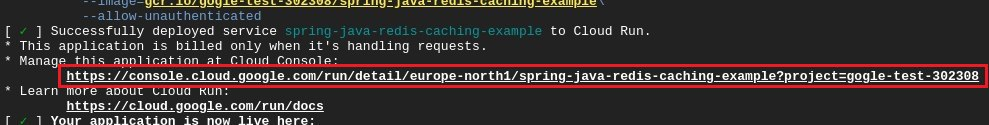
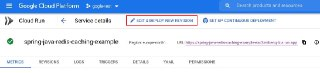
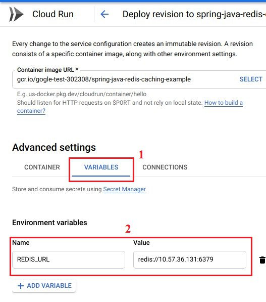
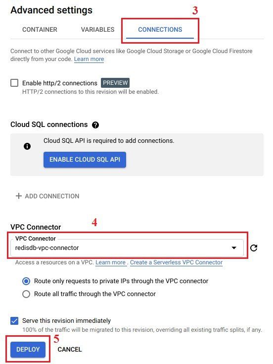

<div style="position: absolute; top: 0px; right: 0px;">
    
</div>

<div style="height: 150px"></div>

# NodeJS Redis Example

Show how the redis works with NodeJS, Express.

## Try it out

<p>
    <a href="https://heroku.com/deploy" target="_blank">
        
    <a>
</p>

<p>
    <a href="https://vercel.com/new/git/external?repository-url=https%3A%2F%2Fgithub.com%2Fredis-developer%2Fbasic-caching-demo-nodejs&env=REDIS_ENDPOINT_URI,REDIS_PASSWORD&envDescription=REDIS_ENDPOINT_URI%20is%20required%20at%20least%20to%20connect%20to%20Redis%20clouding%20server" target="_blank">
        
    </a>
</p>

<p>
    <a href="https://deploy.cloud.run" target="_blank">
        
    </a>
    (See notes: How to run on Google Cloud)
</p>

## How to run on Google Cloud

<p>
    If you don't have redis yet, plug it in  (https://spring-gcp.saturnism.me/app-dev/cloud-services/cache/memorystore-redis).
    After successful deployment, you need to manually enable the vpc connector as shown in the pictures:
</p>

1. Open link google cloud console.



2. Click "Edit and deploy new revision" button.



3. Add environment.



4.  Select vpc-connector and deploy application.



<a href="https://github.com/GoogleCloudPlatform/cloud-run-button/issues/108#issuecomment-554572173">
Problem with unsupported flags when deploying google cloud run button
</a>


## How it works?


## How to run it locally?

#### Copy `.env.sample` to create `.env`. And provide the values for environment variables

    - REDIS_ENDPOINT_URI: Redis server URI
    - REDIS_PASSWORD: Password to the server

#### Run frontend

```sh
cd client
npm run serve
```

#### Run backend

``` sh
npm start
```
