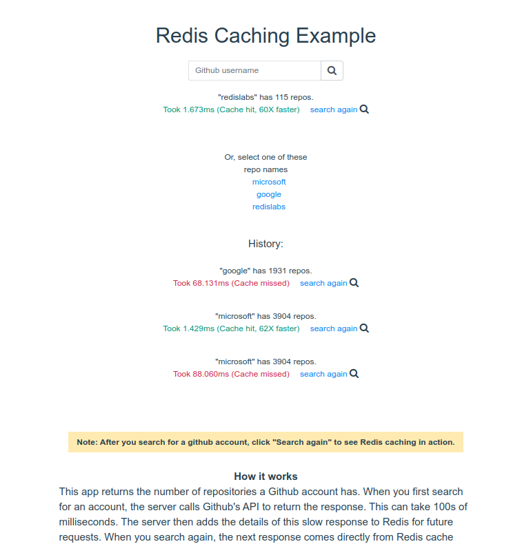

<div style="position: absolute; top: 0px; right: 0px;">
    
</div>

<div style="height: 150px"></div>

# NodeJS Redis Example

Show how the redis works with NodeJS, Express.

## Try it out

<p>
    <a href="https://heroku.com/deploy" target="_blank">
        
    <a>
</p>

<p>
    <a href="https://vercel.com/new/project?template=https://github.com/ITsolution-git/node-express-redis/tree/master" target="_blank">
        
    </a>
</p>

<p>
    <a href="https://deploy.cloud.run" target="_blank">
        
    </a>
</p>


## How it works?



## How to run it locally?

#### Copy `.env.sample` to create `.env`. And provide the values for environment variables

    - REDIS_ENDPOINT_URI: Redis server URI
    - REDIS_PASSWORD: Password to the server

#### Run frontend

```sh
cd client
npm run serve
```

#### Run backend

``` sh
npm start
```
